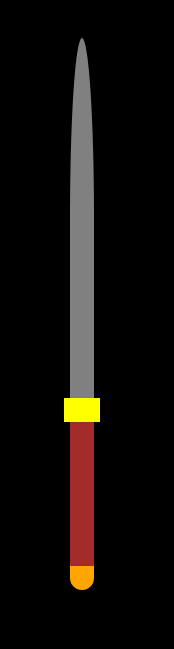
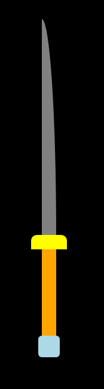
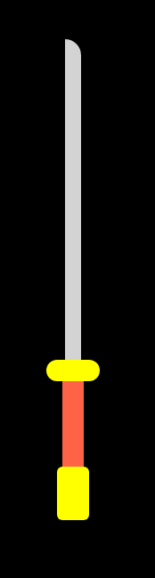

# Hands On: Coloful Sword Styles

## Einführung:
In dieser Aufgabe wird eurer Kreativität keine Grenzen gesetzt, designed euer eigenes Schwert, indem ihr die verschiedenen Elemente selektiert, und ihnen mit Größen, Farben und Radius definitionen euren eigenen Flair gebt.

## Hauptziele

- Du lernst, relative CSS-Einheiten (wie Prozent und Pixel) für die Größenanpassung von HTML-Elementen zu verwenden.
- Du wendest Border-Radius an, um Ecken von Elementen abzurunden.
- Du änderst Farben in CSS, um visuell ansprechende Designs zu erstellen.

## Aufgabe:

- Nutze die vorhandenen Klassen um in der verlinkten CSS datei die jeweiligen einzelteile des Schwertes zu stylen.
    - `.saber .blade` - Die Klinge
    - `.saber .guard` - Die Parierstange
    - `.saber .handle` - Der Griff
    - `.saber .pommel` - Der Knauf

**Tipp:** nutze vor dem Styling den folgenden Code um allen Elementen auf der Seite einen Rahmen zu geben, falls du ihnen zwar eine Größe gegeben hast, aber noch keine Farbe.
````css
*{
    border: 1px solid red;
}
````

> Achte darauf, dass das voreingestellte Styling das Schwert immer mittig auf der Seite positionieren wird.

# Beispiele

Um eure Kreativität anzukurbeln, hier ein paar Beispiele:






## Zusatzaufgabe

Du könntest, wenn du das HTML so anpasst, das du die Parierstange und die Klinge unten wiederholst, und ihnen verschiedene ID's gibst, auch eine Doppelklinge erstellen, und die beiden Klingen unterschiedlich stylen, etwa so:

````html
<div class="saber">
    <div class="blade"></div>
    <div class="guard"></div>
    <div class="handle"></div>
    <div class="guard"></div>
    <div class="blade"></div>
</div>
```


